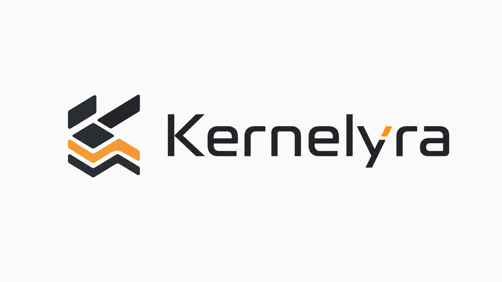

<p align="center">
  
</p>

<p align="center">
  <a href="README.md">English version</a>
</p>

<p align="center"></p>

<p align="center"><strong>Нативное обучение табличных моделей с контролем ресурсов и защитами.</strong></p>

Kernelyra 0.4.0a1 — библиотека для обучения и дообучения табличных моделей из
терминала. Один автоматический планировщик используется в CLI, Python API и
JSONL-протоколе для SDK на других языках.

## Что работает сейчас

- бинарная и многоклассовая классификация, регрессия;
- обучение на CSV, TSV, JSONL/NDJSON, числовых NPZ и Parquet;
- потоковая обработка больших совместимых табличных файлов и папок;
- встроенный нативный backend, NumPy, а также опциональные PyTorch и TensorFlow/Keras;
- автоматический выбор backend, профиля железа, batch size и размеров модели;
- четыре режима: слабый ПК, сбалансированный ПК, мощный ПК и рабочая станция;
- checkpoints, продолжение обучения, отложенная проверка, остановка по результату и Model Guard;
- лимиты CPU/RAM/GPU, изолированные worker-процессы, защита от NaN и аварийная остановка;
- Python, CLI и JSONL SDK-адаптеры для C, C++, C#, Rust, Go, PHP, Java, Kotlin,
  Swift и Ruby.

## Установка из исходников

Текущая alpha-версия устанавливается из исходников. Публикация на PyPI для
этого релиза не настроена:

```powershell
git clone https://github.com/Solveran601/Kernelyra.git
Set-Location Kernelyra
python -m pip install -e .
```

`.[data]` нужен только для Parquet, `.[torch]` — для PyTorch, а
`.[tensorflow]` — для TensorFlow/Keras.

## Быстрый старт

```powershell
python -m kernelyra doctor
python -m kernelyra plan .\data\train.csv --target label
python -m kernelyra train .\data\train.csv --target label
```

Перед обучением Kernelyra проверяет датасет и показывает итоговый план. Если
целевая колонка неоднозначна или настройка ресурсов небезопасна, команда
останавливается с понятной ошибкой, а не угадывает параметры.

## Python

```python
from kernelyra import fit

result = fit("train.csv", "label", workspace="./project")
print(result.checkpoint)
```

Для ручного контроля используй `Config` и `Engine`: backend, профиль, бюджет
ресурсов, архитектура и параметры Model Guard доступны без низкоуровневой
настройки запуска.

## Текущие ограничения

Kernelyra 0.3 обучает только табличные модели. Встроенных тренеров для текста,
изображений, аудио, видео, 3D и других мультимодальных данных пока нет.
Распознавание файла не означает, что формат можно извлечь или использовать для
обучения.

Поддерживаемая цель релиза — Windows x64 и Python 3.11–3.13. Linux, macOS и
Windows ARM не являются целевыми платформами релиза 0.3.

## Дополнительно

Для списка доступных команд выполни `python -m kernelyra --help`. Во время
alpha-периода 0.3 интерфейс и документация проекта остаются намеренно компактными.
Условия распространения находятся в [лицензии](LICENSE).

Заявления о производительности публикуются только вместе с воспроизводимым
отчётом: задачей, железом, версиями пакетов, качеством модели и измерением
памяти. В Kernelyra есть benchmark harness, но README не заявляет
непроверенного универсального превосходства по скорости.
