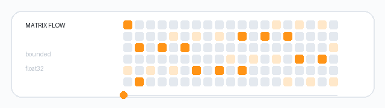
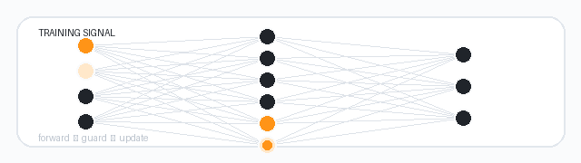

<p align="center"></p>

<p align="center">
  
</p>

<p align="center">
  <a href="README.md">English version</a>
</p>

<p align="center"></p>

<p align="center"><strong>Нативное обучение табличных данных с контролем ресурсов.</strong></p>

Kernelyra **0.7.0b1 (beta)** — локальная библиотека для обучения табличных
моделей из терминала. Один и тот же путь планирования доступен в CLI, Python
API, PowerShell-модуле и JSONL-протоколе для поставляемых SDK.

<p align="center">
  <a href="#capabilities">Возможности</a> ·
  <a href="#install">Установка</a> ·
  <a href="#powershell">PowerShell</a> ·
  <a href="#limits">Ограничения</a>
</p>

<a id="capabilities"></a>

## Что работает в этой beta-версии

- Бинарная и многоклассовая классификация, а также регрессия на табличных
  данных.
- Прямое обучение на CSV, TSV, JSONL/NDJSON, числовых NPZ и опциональном
  Parquet.
- Встроенные CPU-backend native и NumPy; опциональные PyTorch и TensorFlow/Keras
  дают строгий путь `hybrid` (CPU + GPU), когда обнаружена доступная видеокарта.
  В native-core есть пять наблюдаемых ролей: C ABI с
  проверкой размеров, C++ dispatcher, Rust policy, Fortran numeric kernels и
  Zig memory kernels.
  Поле `native_execution` показывает только движки, которые действительно
  участвовали в вызовах конкретной модели; оно не считает все пять «по умолчанию».
- Явный выбор выполнения `cpu` или `hybrid` и заданные разработчиком лимиты
  CPU/RAM/GPU/потоков. Единая автоматическая политика вычисляет ограниченные
  настройки потоков, bulk-вызовов, чанков, предзагрузки и арены, не
  классифицируя компьютер пользователя. Постоянные checkpoint по умолчанию
  **выключены**. Пользователь сам выбирает `none`, `best` или `last` для
  resume/final; Model Guard может восстановить модель только при явно заданном
  `checkpoint_rollback="best"`.
- Data Doctor: ограниченная предварительная проверка, подписанный контракт
  датасета, детерминированная рекомендация split и план неравномерных чанков.
- Доли split, явную context/group-колонку, а также target/minimum/maximum
  для неравномерных чанков можно задать в Python, CLI, PowerShell или TOML.
  Streaming применяет эти значения; context-ключ исключается из признаков и
  никогда не пересекает split.
- Подготовка UTF-8-текста: native-планирование чанков при доступном native-core,
  обратимый byte-токенизатор и causal loss-mask для будущего тренера. Это не
  LLM-тренер.
- Потоковая подготовка диалогов для `.txt`, `.md`, `.log`, JSONL/NDJSON и
  Telegram `result.json`: читается по одному сообщению, исходное сообщение
  никогда не разрывается, а чанк закрывается на границе диалога, явном
  временном разрыве, лимите размера или консервативном лексическом признаке
  новой темы. Без указанного пути вывода подготовленный набор не записывается.
  Это не встроенный LLM-тренер.
- Model Guard V2: проверка конечности метрик и сохранение тренда качества в
  health-записи run. Его публичный evaluator не имеет побочных действий: он
  возвращает доказательства и не создаёт, не восстанавливает и не удаляет
  checkpoint без решения пользователя.
- Переносимые JSON/HTML-отчёты эксперимента и явные лимиты CPU/RAM/GPU.
- Детерминированный `kernelyra native self-test` проверяет установленный
  native ABI несколькими float32-операциями в памяти. Он не создаёт workspace
  и не обучает модель.

Data Doctor намеренно ограничен выборкой: выводы относятся к проверенным
строкам, а не ко всему датасету. Для materialized training классификация
разделяется детерминированно по классам, а time-like колонка сохраняет исходный
порядок входных строк. Для CSV, TSV, JSONL/NDJSON и Parquet AutoTrainer при
обнаружении group/context-колонки переводит данные в streaming split: каждый
контекст остаётся в одном split, а его идентификатор исключается из признаков.
Для форматов без такого streaming-пути остаётся явное предупреждение об утечке.

<a id="install"></a>

<p align="center"></p>

<p align="center"><sub>Нативные bulk-обновления повторно используют ограниченные буферы, а loss возвращается на финальном шаге.</sub></p>

## Установка

Эта beta публикуется как Windows x64 wheel в
[GitHub Releases](https://github.com/Solveran601/Kernelyra/releases/tag/v0.7.0b1).
Публикация на PyPI пока не включена. Для Python 3.11–3.13 установи wheel:

```powershell
python -m pip install "https://github.com/Solveran601/Kernelyra/releases/download/v0.7.0b1/kernelyra_ai-0.7.0b1-py3-none-win_amd64.whl"
```

Или установи исходную копию:

```powershell
git clone https://github.com/Solveran601/Kernelyra.git
Set-Location Kernelyra
py -3.13 -m pip install .
```

`.[data]` нужен для Parquet, `.[torch]` — для PyTorch, а `.[tensorflow]` — для
TensorFlow/Keras.

<a id="powershell"></a>

## CLI из PowerShell

```powershell
python -m kernelyra version
python -m kernelyra doctor
python -m kernelyra execution
python -m kernelyra --json native self-test
python -m kernelyra plan .\data\train.csv --workspace .\runs --target label --execution cpu --cpu 100 --ram 85 --threads 12
```

При необходимости сначала выполни явную проверку данных:

```powershell
python -m kernelyra dataset doctor .\data\train.csv --workspace .\runs --target label
```

Перед выделением ресурсов можно посмотреть автоматическую политику выполнения:

```powershell
python -m kernelyra tune --execution cpu --records 100000 --features 64 --batch-size 128
```

Ограничения аллокаций, границы контекста и Model Guard являются обязательными
защитами.
Чтобы получить постоянную лучшую модель и автоматический откат, включи это
явно: `--checkpoint-final best --checkpoint-rollback best`. Без такого выбора
Model Guard остановит ухудшающийся запуск, но не создаст и не восстановит
checkpoint.

Можно разобрать большой Telegram-экспорт без загрузки целого файла в память и
без записи нового файла:

```powershell
python -m kernelyra text plan .\Telegram\result.json --maximum-characters 8192
```

Добавь `--output .\prepared\telegram-chunks.jsonl`, только если хочешь
записать подготовленный JSONL.

## Python

```python
from kernelyra import Engine, ModelGuard, iter_conversation_chunks, native_core_self_test

with Engine(workspace="./runs") as kernelyra:
    health = kernelyra.doctor("train.csv", "label")
    result = kernelyra.fit("train.csv", "label", backend="auto")
    run = kernelyra.run(result.run.id)
    print(run.status, run.metrics, run.logs(limit=20))
    report = run.report("./run-report.json")  # запись только при явном пути

print(report["output"])

guard = ModelGuard(degradation_margin=.03, degradation_patience=3)
evidence = guard.inspect(
    score=.71, loss=.42, metrics={"accuracy": .71}, best_score=.75,
    scores=[.75, .73, .71],
)
print(evidence["status"], evidence["restore_recommended"])

native = native_core_self_test()
if native["available"] and not native["ok"]:
    raise RuntimeError(native["diagnostic"])

for chunk in iter_conversation_chunks("Telegram/result.json"):
    print(chunk.boundary, len(chunk.messages), chunk.text[:80])
```

<p align="center"></p>

<p align="center"><sub>Нативные вычисления проверяются на каждом обновлении; схема иллюстративна и не означает наличие LLM-тренера.</sub></p>

Настройки также можно проверить до открытия датасета или workspace:

```python
from kernelyra import Settings

settings = Settings().cpu_only().resources(cpu=85, ram=70, threads=8)
print(settings.explain())  # файловых записей нет
```

Kernelyra — обычная установленная Python-библиотека: она не создаёт и не
активирует виртуальное окружение. У `import kernelyra` нет файловых побочных
эффектов. Stateful-вызовы API требуют `workspace=...`; только в этой явно
указанной папке Kernelyra создаёт базу запусков, копии табличных данных или
checkpoint. Итератор текстовых чанков ничего не записывает.

Чтобы использовать имена команд PowerShell из исходной копии проекта:

```powershell
Import-Module .\powershell\Kernelyra.psd1 -Force
Test-KernelyraDataset .\data\train.csv -Target label -Workspace .\runs
Get-KernelyraDataContract .\data\train.csv -Target label -Workspace .\runs
Get-KernelyraNativeStatus
Get-KernelyraCpuTuning -Records 100000 -Features 32 -BatchSize 64
Get-KernelyraCpuTuning -Records 100000 -Features 64 -BatchSize 128
Get-KernelyraPlan .\data\train.csv -Target label -Workspace .\runs
Start-KernelyraTraining .\data\train.csv -Target label -Workspace .\runs -Execution cpu -Cpu 100 -Ram 85 -Threads 12
```

<a id="limits"></a>

## Ограничения и граница roadmap

Проверяемая цель релиза — **Windows x64 с Python 3.11–3.13**. Kernelyra 0.7
обучает только табличные модели. В ней нет встроенных тренеров для LLM,
изображений, аудио, видео, 3D и других модальностей. Распознавание расширения
не означает, что его можно извлечь, обучать на нём модель или использовать как
поддерживаемый model container.
`hybrid` требует обнаруженного ускорителя и установленного совместимого
опционального backend. Native и NumPy намеренно работают только на CPU: при
принудительном hybrid-запуске они не становятся тихим CPU-fallback.

## Дополнительно

Выполни `python -m kernelyra --help` для списка команд и
`python -m kernelyra formats` для уровней возможностей. Также см. [changelog](CHANGELOG.md),
[правила участия](CONTRIBUTING.md), [security policy](SECURITY.md),
[уведомления о сторонних компонентах](THIRD_PARTY_NOTICES.md) и [лицензию](LICENSE).

<p align="center"></p>
