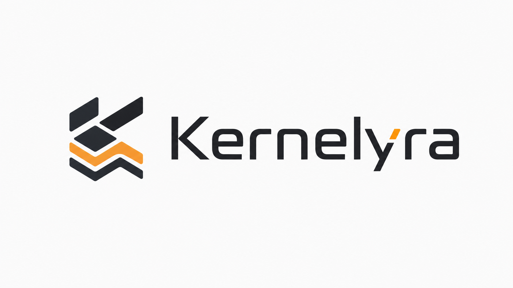

<p align="center">
  
</p>

<p align="center">
  <a href="README.md">English version</a>
</p>

<p align="center"></p>

<p align="center"><strong>Нативное обучение табличных данных с контролем ресурсов.</strong></p>

Kernelyra **0.5.0a1 (V3 alpha)** — локальная библиотека для обучения табличных
моделей из терминала. Один и тот же путь планирования доступен в CLI, Python
API, PowerShell-модуле и JSONL-протоколе для поставляемых SDK.

## Что работает в этой alpha-версии

- Бинарная и многоклассовая классификация, а также регрессия на табличных
  данных.
- Прямое обучение на CSV, TSV, JSONL/NDJSON, числовых NPZ и опциональном
  Parquet.
- Встроенные native и NumPy backend; PyTorch и TensorFlow/Keras — опционально,
  когда они установлены.
- Автоматический план ресурсов, четыре программы выполнения (слабый ПК,
  сбалансированный ПК, мощный ПК, рабочая станция), checkpoints, resume,
  отложенная проверка и восстановление лучшего checkpoint.
- Data Doctor: ограниченная предварительная проверка, подписанный контракт
  датасета, детерминированная рекомендация split и план неравномерных чанков.
- Model Guard V2: проверка конечности метрик и сохранение тренда качества в
  health-записи run.
- Переносимые JSON/HTML-отчёты эксперимента и явные лимиты CPU/RAM/GPU.

Data Doctor намеренно ограничен выборкой: выводы относятся к проверенным
строкам, а не ко всему датасету. Для materialized training классификация
разделяется детерминированно по классам, а time-like колонка сохраняет исходный
порядок входных строк. Обнаруженная group/context колонка пока является только
**предупреждением**: group-exclusive split в 0.5 ещё не реализован.

## Установка из исходников

Публикация на PyPI не настроена. После успешной сборки GitHub Actions для тега
Windows-артефакты этой alpha-версии прикрепляются к её GitHub pre-release.

```powershell
git clone https://github.com/Solveran601/Kernelyra.git
Set-Location Kernelyra
python -m pip install -e .
```

`.[data]` нужен для Parquet, `.[torch]` — для PyTorch, а `.[tensorflow]` — для
TensorFlow/Keras.

## Три команды PowerShell

```powershell
python -m kernelyra doctor
python -m kernelyra plan .\data\train.csv --target label
python -m kernelyra train .\data\train.csv --target label
```

При необходимости сначала выполни явную проверку данных:

```powershell
python -m kernelyra dataset doctor .\data\train.csv --target label
```

## Python

```python
from kernelyra import Engine

with Engine("./project") as kernelyra:
    health = kernelyra.doctor("train.csv", "label")
    result = kernelyra.fit("train.csv", "label", backend="auto")
    report = kernelyra.report(result.run.id, "./project/run-report.json")

print(report["output"])
```

Чтобы использовать имена команд PowerShell из исходной копии проекта:

```powershell
Import-Module .\powershell\Kernelyra.psd1 -Force
Test-KernelyraDataset .\data\train.csv -Target label
Get-KernelyraPlan .\data\train.csv -Target label
```

## Ограничения и граница roadmap

Проверяемая цель релиза — **Windows x64 с Python 3.11–3.13**. Kernelyra 0.5
обучает только табличные модели. В ней нет встроенных тренеров для LLM,
изображений, аудио, видео, 3D и других модальностей. Распознавание расширения
не означает, что его можно извлечь, обучать на нём модель или использовать как
поддерживаемый model container.

V3 workflow benchmark измеряет локальную предварительную проверку и
планирование; это не сравнение с конкурентами и не универсальное заявление о
скорости. Точные входные данные и окружение сохранены в
[V3 JSON-отчёте](reports/v3-workflow-benchmark-2026-08-25.json).
Отдельный CPU-only matched-linear запуск сохраняет фактические результаты
Kernelyra, NumPy, PyTorch и JAX без ранжирования разных алгоритмов в
[framework matrix](reports/v3-framework-cpu-2026-08-25.json).
Более новая [CPU-матрица](reports/CPU_BENCHMARK_2026-08-26.md) фиксирует
Kernelyra и десять ML-библиотек на независимом hold-out наборе, оставляя
деревья и online-обучение вне линейного сравнения скорости.

## Дополнительно

Выполни `python -m kernelyra --help` для списка команд и
`python -m kernelyra formats` для уровней возможностей. Также см. [changelog](CHANGELOG.md),
[правила участия](CONTRIBUTING.md), [security policy](SECURITY.md),
[уведомления о сторонних компонентах](THIRD_PARTY_NOTICES.md) и [лицензию](LICENSE).
